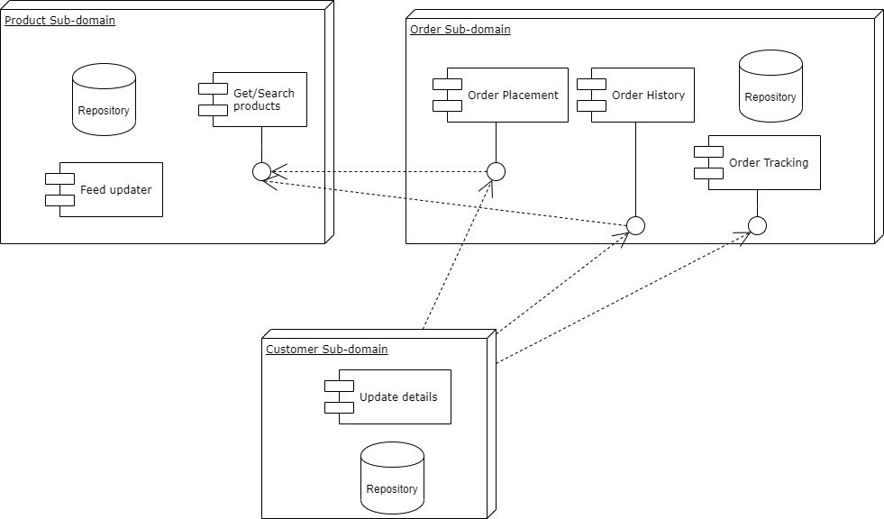

# Design Example 1

### Scenario:
An e-commerce clothing store is looking to re-design its monolithic system into a more modular system following domain driven design. Below are the main processes, flows, and functionalities in the system:
Customers can view, filter and sort products on the site.
Customers can order products, paying via card or through Paypal.
Customers can redeem gift coupons and promotions to purchase products at a discounted price.
Products should be updated via regular product feeds to update availability, sizes, and discontinuations.
Customers can view their order history
Customers can track unfulfilled orders.
Customers can edit their personal information such as contact details and billing address.

We can identify three main areas in our problem domain that can be viewed as sub-domains. These are:
**The customer sub-domain**, responsible for handling customer-related information and performing functionality such as updating user details.

**The order sub-domain**, responsible for handling order-related functionality such as order histories, tracking, and fulfillment. Promotions and coupons could also be part of this sub-domain and form part of the order domain entity. However, it's also possible to split these into their own sub-domain. Similarly with payments.

**The product sub-domain**, responsible for handling functionality such as search, product feed updates. The core domain entity here would, of course, be the product entity.

The following is a high-level component diagram:

Now, let's identify some Domain-driven design elements that will help us design our system, and code it out in later sections of the course. Let's discuss these within the bounded context of each subdomain:

#### Product Sub-domain
The product here is an entity that can be identified by its Id. A product can also act as the domain root of the components within the product module.
The product can have properties that are entities such as the nearest available store, whilst other properties could be value objects such as the product color.
Once the feed updater has triggered a product update, a domain event can be emitted that can be picked up by interested components - such as the customer sub-domain to notify users that products they are interested in are available.

#### Order Sub-domain
The order is definitely an entity as it is uniquely identifiable by its Id.
The sub-domain's components could emit order created/updated/fulfilled domain events that would most likely interest the customer sub-domain.
The order placement component could make use of an Order Cost Calculation domain service, that order domain objects would call to obtain the order total values. Another possible domain service would be a shipping calculator service.

#### Customer Sub-domain
The customer object here will definitely be an entity, identified by Id.
It could contain both value types such as the address together with sub-entities.
Quite a straightforward sub-domain so there seems to be no immediate need for domain services or events.
Applicable to all sub-domains:
Use of repository pattern to persist domain objects.
Use of factory pattern to create domain objects.

We will discuss this in further detail in the next lecture. In the meantime, don't worry if your solution is different as there is more than one correct answer!

